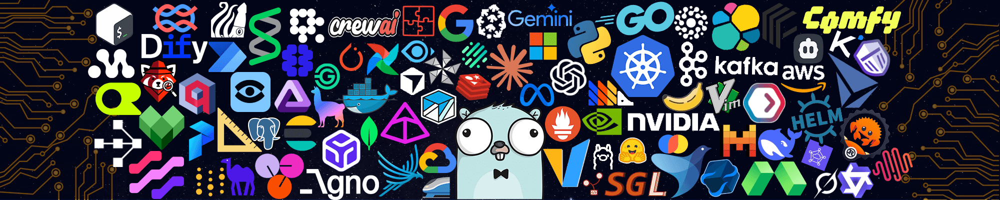

<div align="center">



<h1>Hi, I'm Arif Pebryan 👋</h1>

<p>
  I build useful software with a focus on clear interfaces, dependable systems,<br />
  and the small details that make products feel effortless.
</p>

<p>
  <a href="https://github.com/xFlawlessDev"></a>
  <a href="mailto:arifpebryan22@gmail.com"></a>
  <a href="https://www.linkedin.com/in/arifpebryan/"></a>
</p>

</div>

## Profile

```rust
struct Arif {
    location: &'static str,
    role: &'static str,
    focus: [&'static str; 3],
    currently: &'static str,
    open_to: &'static str,
}

let arif = Arif {
    location: "Jakarta, Indonesia",
    role: "Software Engineer",
    focus: ["Product engineering", "Developer experience", "Systems"],
    currently: "Building calm software for complex workflows",
    open_to: "Interesting products and thoughtful collaborations",
};
```

- Building full-stack products across web, desktop, and backend systems.
- Currently working with Rust, TypeScript, Vue, React, and Tauri.
- I care about accessible UI, fast feedback loops, and software that is easy to maintain.
- Ask me about product engineering, frontend architecture, or making operational tools feel human.

## Tech Stack

The tools I reach for when a product needs to be clear, fast, and dependable.

### Frontend Engineering

<p align="left">
  
  
  
  
  
  
</p>

### Backend & Desktop Systems

<p align="left">
  
  
  
  
</p>

### Data & Infrastructure

<p align="left">
  
  
  
  
</p>

<p align="center"><sub>Always learning. Always refining the toolset to fit the problem.</sub></p>

## GitHub Metrics

<div align="center">


<br />


<br />


</div>

## Contribution Snake

<div align="center">

<picture>
  <source media="(prefers-color-scheme: dark)" srcset="https://raw.githubusercontent.com/xFlawlessDev/xFlawlessDev/output/github-contribution-grid-snake-dark.svg" />
  <source media="(prefers-color-scheme: light)" srcset="https://raw.githubusercontent.com/xFlawlessDev/xFlawlessDev/output/github-contribution-grid-snake.svg" />
  
</picture>

</div>


## Contact

Have a good problem, a product idea, or a collaboration in mind? I would like to hear it.

<div align="center">

<a href="mailto:arifpebryan22@gmail.com">Email me</a> ·
<a href="https://www.linkedin.com/in/arifpebryan/">LinkedIn</a> ·
<a href="https://github.com/xFlawlessDev">GitHub</a>

<br /><br />


</div>

<div align="center">
  <sub>Thanks for stopping by. Build something useful today.</sub>
</div>
